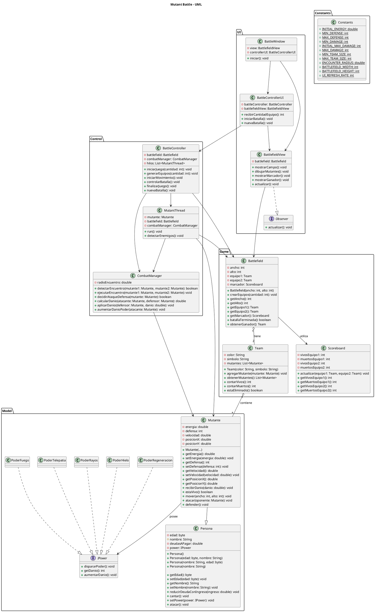

# Mutant Battle

## Descripción

Mutant Battle es un juego automático en el que dos equipos de mutantes se enfrentan en un campo de batalla.

El usuario únicamente proporciona el tamaño de los equipos. A partir de este dato, el sistema genera los mutantes de forma aleatoria y ejecuta la batalla automáticamente hasta que uno de los equipos quede sin mutantes vivos.

El proyecto será desarrollado en Java y estará organizado en cuatro capas: **Model, Game, Control y UI**.

---

# Especificación de objetos

## Model Layer

Esta capa representa los objetos principales del sistema y sus características.

### Persona

Clase base que representa la información general de una persona.

**Responsabilidades:**

- Almacenar información básica de una persona.
- Permitir consultar y modificar sus datos.
- Servir como clase base para los mutantes.

### Mutante

Representa a un participante de la batalla.

**Características:**

- Nombre.
- Edad.
- Energía.
- Capacidad de defensa.
- Posición dentro del campo.
- Velocidad de movimiento.
- Un poder mutante.

**Responsabilidades:**

- Mantener su estado durante la batalla.
- Moverse dentro del campo de batalla.
- Atacar a otros mutantes.
- Defenderse de los ataques.
- Recibir daño.
- Mantener actualizada su energía.
- Determinar si continúa con vida.

### IPower

Interfaz que define el comportamiento general de los poderes mutantes.

**Responsabilidades:**

- Definir las operaciones que debe tener un poder.
- Mantener su capacidad de daño.
- Permitir diferentes tipos de poderes mediante polimorfismo.

### PoderHielo

Representa un poder basado en hielo e implementa `IPower`.

### PoderRayos

Representa un poder basado en rayos e implementa `IPower`.

### PoderTelepatia

Representa un poder basado en telepatía e implementa `IPower`.

### PoderFuego

Representa un poder basado en el fuego e implementa `IPower`.

### PoderRegeneracion

Representa un poder basado en regeneración e implementa `IPower`.

---

# Game Layer

Esta capa representa el espacio de juego y administra los equipos que participan en la batalla.

### Team

Representa uno de los dos equipos de mutantes.

**Características:**

- Color.
- Escudo o símbolo.
- Mutantes pertenecientes al equipo.

**Responsabilidades:**

- Mantener los mutantes del equipo.
- Identificar al equipo mediante su color y símbolo.
- Contabilizar los mutantes vivos.
- Contabilizar los mutantes muertos.

### Battlefield

Representa el campo de batalla y su estado actual.

**Características:**

- Dimensiones del campo.
- Dos equipos.
- Marcador de la batalla.

**Responsabilidades:**

- Crear y mantener los dos equipos.
- Mantener la misma cantidad de mutantes en ambos equipos.
- Proporcionar las dimensiones del campo a los mutantes.
- Mantener el control del estado de la batalla.
- Llevar el conteo de mutantes vivos y muertos.
- Mantener el marcador.
- Determinar cuándo termina la batalla.
- Determinar el equipo ganador.

El tamaño de los equipos estará entre **3 y 11 mutantes**.

---

# Control Layer

Esta capa contiene la lógica necesaria para ejecutar la batalla.

### BattleController

Controla el desarrollo general de una partida.

**Responsabilidades:**

- Iniciar una nueva partida.
- Generar los equipos y sus mutantes.
- Iniciar el movimiento de los mutantes.
- Coordinar el desarrollo de la batalla.
- Detectar cuándo termina la partida.
- Permitir iniciar una nueva batalla.

### MutantThread

Controla las acciones de un mutante durante la batalla mediante concurrencia.

**Responsabilidades:**

- Ejecutar el movimiento del mutante.
- Detectar enemigos dentro del radio configurado.
- Coordinar los encuentros con otros mutantes.
- Permitir que diferentes encuentros ocurran de forma paralela.

### CombatManager

Administra los encuentros entre mutantes enemigos.

**Responsabilidades:**

- Detectar encuentros entre mutantes.
- Coordinar las decisiones de ataque y defensa.
- Calcular el daño producido.
- Actualizar la energía de los mutantes.
- Aumentar la capacidad de daño del poder cuando corresponda.
- Determinar cuándo un mutante queda fuera de combate.

---

# UI Layer

Esta capa se encarga de representar visualmente el estado de la batalla. No contiene la lógica del juego.

### BattlefieldView

Representa la información de la batalla en la interfaz gráfica.

**Responsabilidades:**

- Mostrar el campo de batalla.
- Mostrar todos los mutantes y sus posiciones.
- Identificar el equipo de cada mutante.
- Mostrar la energía de cada mutante.
- Mostrar la cantidad de mutantes vivos y muertos por equipo.
- Mostrar el marcador.
- Mostrar el equipo ganador.
- Permitir iniciar una nueva partida.

La vista utilizará el patrón **Observer** para recibir las actualizaciones del estado de la batalla.

### BattleControllerUI

Controla la interacción del usuario con la interfaz.

**Responsabilidades:**

- Recibir el tamaño de los equipos.
- Iniciar la batalla.
- Permitir iniciar una nueva partida después de finalizar un combate.

---

# Reglas principales

- Los equipos tendrán entre **3 y 11 mutantes**.
- Ambos equipos comenzarán con la misma cantidad de mutantes.
- Cada mutante comenzará con **100 puntos de energía**.
- Cada mutante tendrá una capacidad de defensa entre **1 y 3**.
- Cada mutante podrá tener como máximo **un poder**.
- Cada poder comenzará con una capacidad de daño entre **1 y 3**.
- La capacidad de daño de un poder podrá aumentar hasta un máximo de **7**.
- Los mutantes se moverán continuamente dentro del campo de batalla.
- El movimiento tendrá una velocidad determinada y seguirá un comportamiento aleatorio.
- Cuando dos mutantes enemigos estén dentro del radio configurado, ambos decidirán entre atacar o defender.
- Si el oponente no se defiende, recibirá el daño completo del poder.
- Si el oponente se defiende, el daño se dividirá entre su capacidad de defensa.
- Cuando un ataque reduzca la energía del oponente, el poder del atacante aumentará en **1 unidad**, hasta un máximo de **7**.
- Los encuentros entre diferentes pares de mutantes podrán ejecutarse en paralelo mediante concurrencia.
- La batalla terminará cuando uno de los equipos no tenga mutantes vivos.

---

# Arquitectura del proyecto

| Capa | Responsabilidad |
|---|---|
| **Model** | Representar los objetos, mutantes y poderes. |
| **Game** | Administrar los equipos y el campo de batalla. |
| **Control** | Ejecutar el movimiento y controlar los encuentros y combates. |
| **UI** | Representar visualmente el estado de la batalla. |

El diseño aplicará los principios de:

- **Encapsulamiento**
- **Herencia**
- **Polimorfismo**
- **Separación de responsabilidades**

La interfaz gráfica utilizará los patrones:

- **MVC (Model-View-Controller)**
- **Observer**

Los valores configurables del juego se manejarán mediante una clase de constantes para evitar valores definidos directamente dentro de las clases.

# UML

